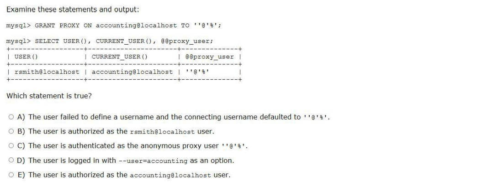
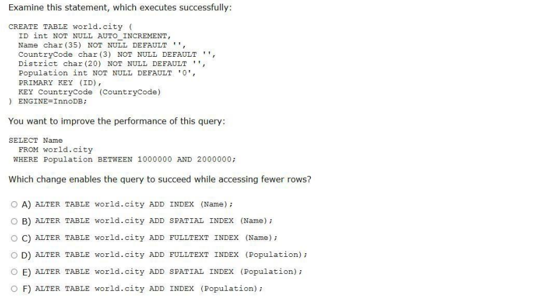
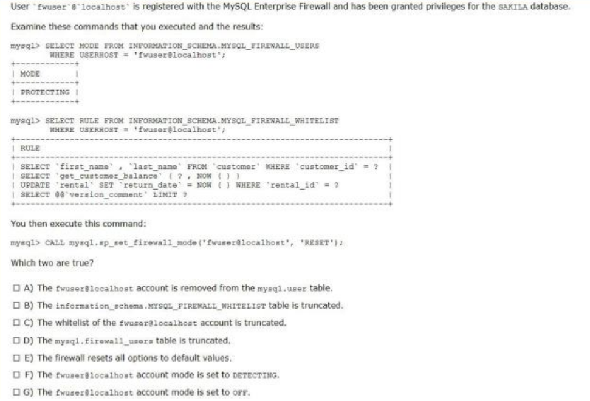

# 1Z0-908

### Q1 

Answer: E

---

### Q2

Answer：C ，D 

✅ C) innodb_print_all_deadlocks গ্লোবাল প্যারামিটার এনাবল করলে, যত ডেডলকই ঘটুক না কেন, সবগুলোর ডিটেইল ইনফরমেশন অটোমেটিক্যালি MySQL সার্ভারের error log-এ সংরক্ষিত হয়।

✅ D) SHOW ENGINE INNODB STATUS কমান্ড চালালে, সেটি বর্তমান ইনোডিবি স্টেট রিপোর্ট করে, যার মধ্যে ডেডলক সংক্রান্ত বিস্তারিত তথ্য থাকে (যেমন কোন ট্রানজ্যাকশন কোন টেবিল বা রো-এর জন্য অপেক্ষা করছে ইত্যাদি)।

---

### Q3

Answer：F

---

### Q4

Answer：C, G

👉 RESET মোড চালানোর ফলে যা ঘটে:

✅ ঐ ব্যবহারকারীর (যেমন fwuser@localhost) whitelist এ থাকা সব SQL কুয়েরি মুছে ফেলা হয়।

✅ ঐ ব্যবহারকারীর firewall মোড OFF করে দেওয়া হয়।

❌ কিন্তু পুরো whitelist টেবিল বা firewall_users টেবিল মুছে ফেলা হয় না, শুধুমাত্র ঐ ইউজারের তথ্য বাদ দেওয়া হয়।

---

