# 1Z0-908

### Q1 


Answer: E

---

### Q2


Answer：C ，D 

✅ C) innodb_print_all_deadlocks গ্লোবাল প্যারামিটার এনাবল করলে, যত ডেডলকই ঘটুক না কেন, সবগুলোর ডিটেইল ইনফরমেশন অটোমেটিক্যালি MySQL সার্ভারের error log-এ সংরক্ষিত হয়।

✅ D) SHOW ENGINE INNODB STATUS কমান্ড চালালে, সেটি বর্তমান ইনোডিবি স্টেট রিপোর্ট করে, যার মধ্যে ডেডলক সংক্রান্ত বিস্তারিত তথ্য থাকে (যেমন কোন ট্রানজ্যাকশন কোন টেবিল বা রো-এর জন্য অপেক্ষা করছে ইত্যাদি)।

---

### Q3


Answer：F

---

### Q4


Answer：C, G

👉 RESET মোড চালানোর ফলে যা ঘটে:

✅ ঐ ব্যবহারকারীর (যেমন fwuser@localhost) whitelist এ থাকা সব SQL কুয়েরি মুছে ফেলা হয়।

✅ ঐ ব্যবহারকারীর firewall মোড OFF করে দেওয়া হয়।

❌ কিন্তু পুরো whitelist টেবিল বা firewall_users টেবিল মুছে ফেলা হয় না, শুধুমাত্র ঐ ইউজারের তথ্য বাদ দেওয়া হয়।

---

### Q5

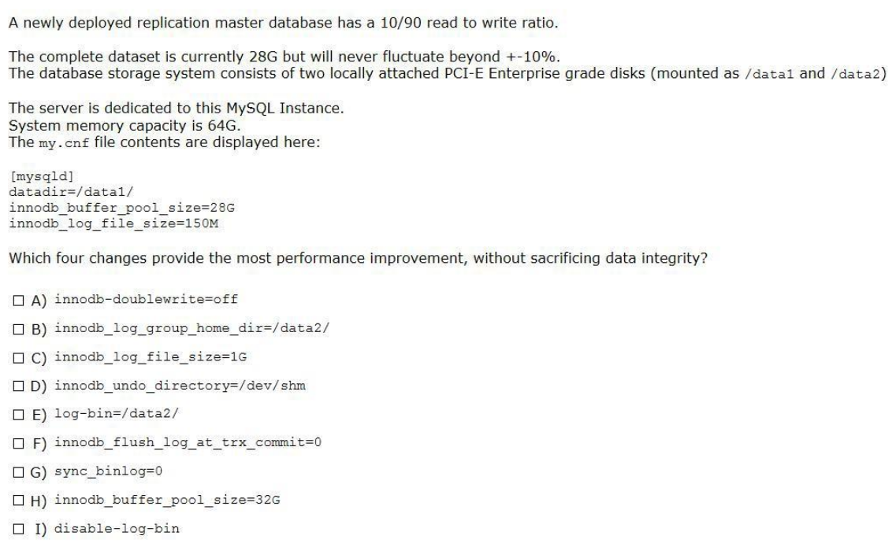

Answer: B C E H

B) `innodb_log_group_home_dir=/data2/`
→ `WAL (write-ahead logging)` আলাদা ডিস্কে রাখলে I/O পারফরম্যান্স বাড়ে, কারণ data ও log আলাদাভাবে লেখা যায়।

C) `innodb_log_file_size=1G`
→ বড় লগ ফাইল `write-heavy workload`-এ ভালো, কম ফ্লাশ করতে হয় → কম I/O → ভালো পারফরম্যান্স।

E) `log-bin=/data2/`
→ `Binary logs` আলাদা ডিস্কে রাখলে write performance বাড়ে (replication ও point-in-time recovery কাজে আসে)। data এবং log আলাদা রাখতে পারলে bottleneck কমে।

H) `innodb_buffer_pool_size=32G`
→ বর্তমানে 28G, কিন্তু সার্ভারে আরও মেমোরি ফাঁকা আছে। বাড়িয়ে 32G করলে আরও ভালো cache পাওয়া যাবে। এটা dataset এর প্রায় পুরোটা ধরবে, এবং কিছু বাড়তি buffer থাকবে।

---

### Q6

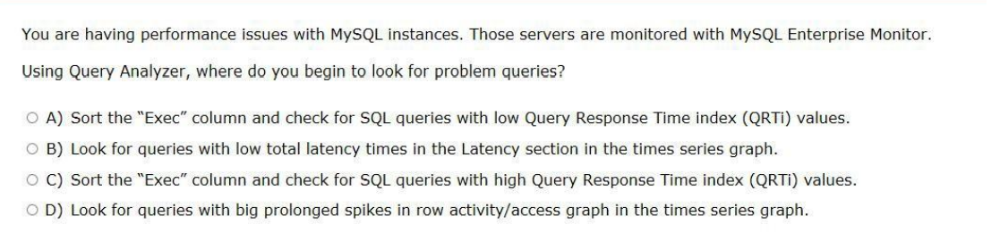

Answser：C  [Note: According to Dump: A]

> ব্যাখ্যা: QRTi (Query Response Time Index) একটি মেট্রিক, যেটা দেখায় একটি কুয়েরি অন্যদের তুলনায় কতটা ধীর বা ভারী।

> উচ্চ QRTi মান = ওই কুয়েরি পারফরম্যান্সে সমস্যা করছে এবং অপটিমাইজ করা দরকার।

> "Exec" column দেখালে বোঝা যায়, কোন কুয়েরিগুলো বেশি চলছে এবং তার QRTi কেমন — এই দুটি মেট্রিক মিলিয়েই সমস্যা চিহ্নিত করা সহজ হয়।

---

### Q7

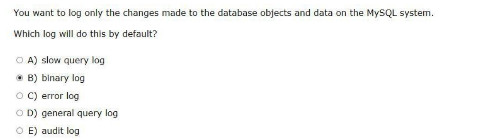

Answser：B

---

### Q8

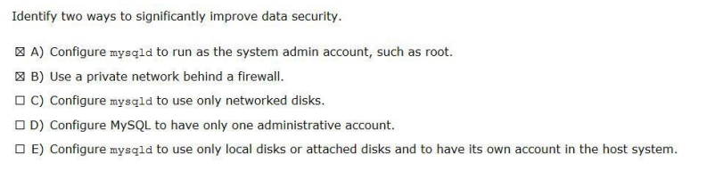

Answer:B E

- ✅ B) Use a private network behind a firewall
    - একটি ফায়ারওয়াল এর পেছনে প্রাইভেট নেটওয়ার্ক ব্যবহার করলে বাইরের অবাঞ্ছিত অ্যাক্সেস ঠেকানো যায়। 
    - এটি ডেটাবেজ সার্ভারের নিরাপত্তা নিশ্চিত করার সবচেয়ে গুরুত্বপূর্ণ ধাপগুলোর একটি।
- ✅ E) Configure mysqld to use only local disks or attached disks and to have its own account in the host system
    - Local বা Attached disk ব্যবহার করলে ডেটা অ্যাক্সেস সীমিত হয় লোকাল হোস্টে।
    - MySQL-এর জন্য আলাদা system user account তৈরি করলে অনুমতি (permissions) ভালোভাবে নিয়ন্ত্রণ করা যায়।
    - এটি প্রিন্সিপল অফ লিমিটেড প্রিভিলেজ (least privilege) অনুসরণ করে নিরাপত্তা বাড়ায়।

---

### Q9


Answer:C, F

- ✅ C) It can perform hot or warm backups
    - MySQL Enterprise Backup সার্ভার বন্ধ না করেই (অর্থাৎ hot/warm অবস্থায়) ব্যাকআপ নিতে পারে।
    - এটি প্রোডাকশন সার্ভারে downtime ছাড়াই ব্যাকআপ নেওয়ার জন্য কার্যকর।

- ✅ F) It supports the creation of incremental backups
    - এটি incremental backup সাপোর্ট করে, অর্থাৎ শুধুমাত্র শেষ ব্যাকআপের পর যেসব ডেটা পরিবর্তিত হয়েছে, সেগুলোকেই ব্যাকআপ করে।
    - এতে storage space এবং backup time কম লাগে।

---

### Q10

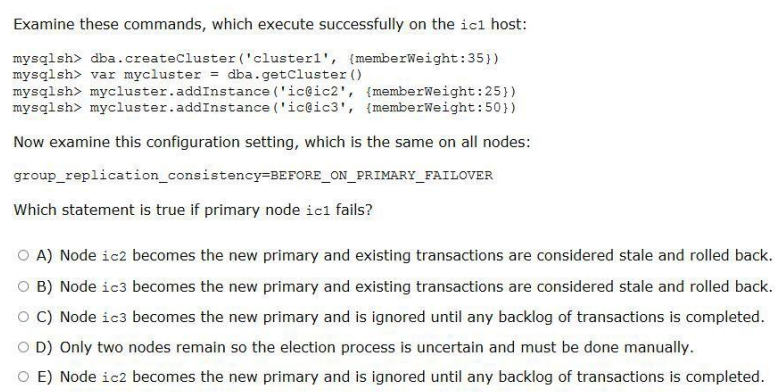

Answer: C

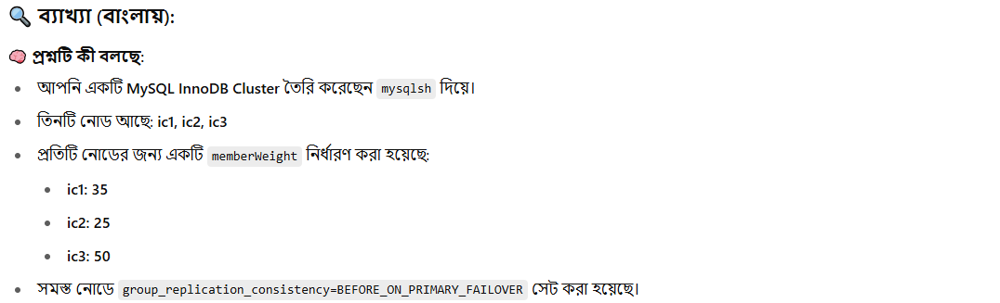

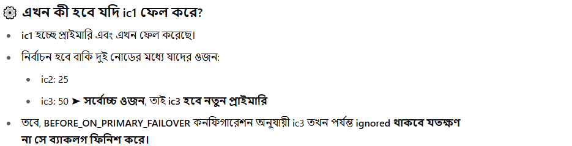

---

### Q11

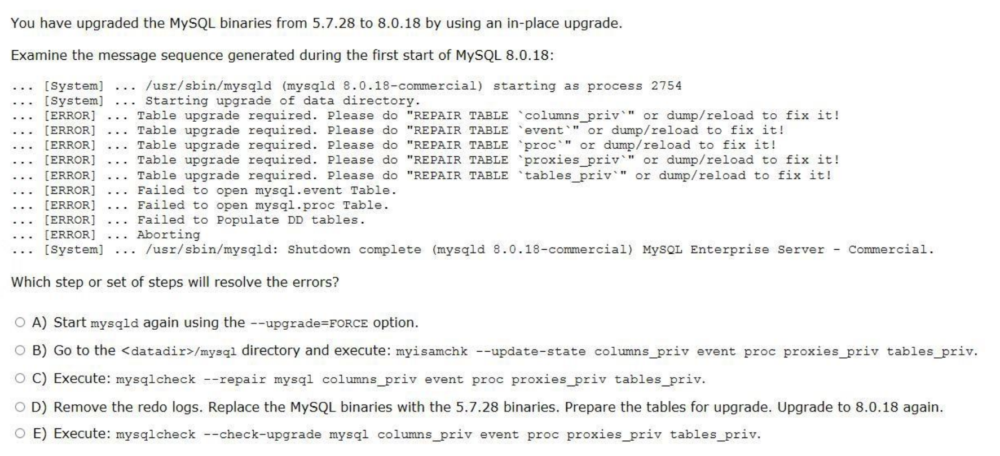

Answer：C

```
mysqlcheck --repair mysql columns_priv event proc proxies_priv tables_priv
```

এই কমান্ডটি সংশ্লিষ্ট সিস্টেম টেবিলগুলিকে মেরামত করে, ফলে ডেটা ডিকশনারি (DD) আপডেট সফলভাবে হতে পারে।


---

### Q12

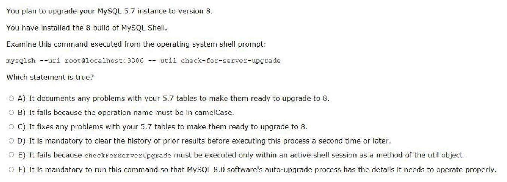

Answer：A

A) এটি আপনার 5.7 টেবিলের যেকোনো সমস্যার তথ্য সংগ্রহ করে যাতে সেগুলো 8-এ আপগ্রেডের জন্য প্রস্তুত হয়।

---

### Q13 

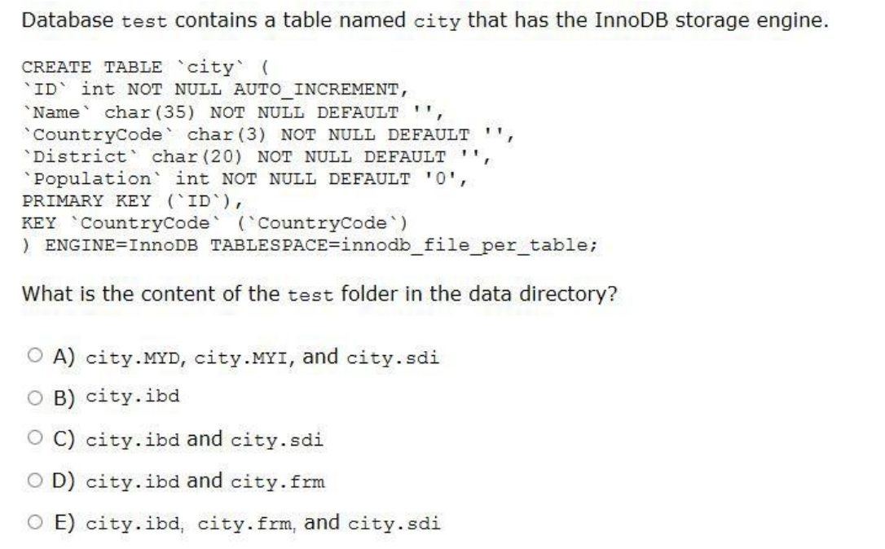

Answer：E (In dumps : A)

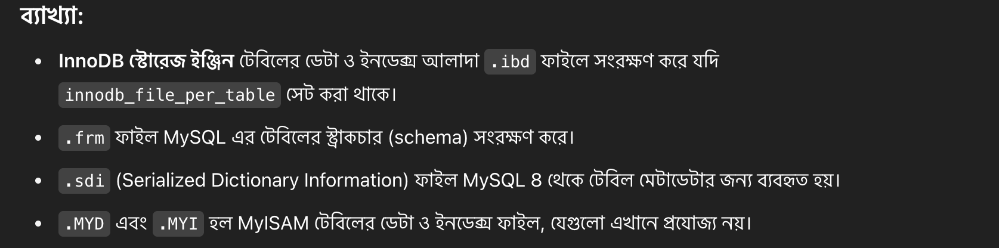

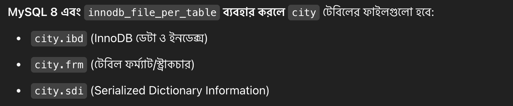

---

### Q14

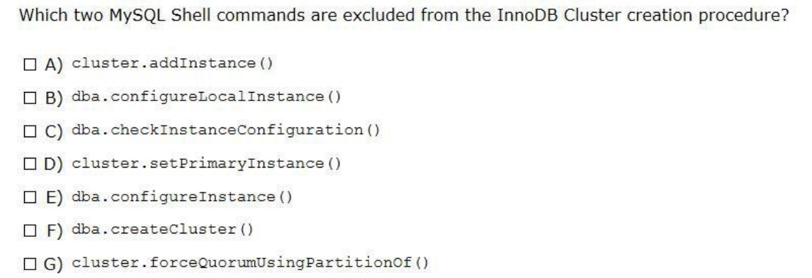

Anwer：D G

D) cluster.setPrimaryInstance(): এই কমান্ডটি একটি বিদ্যমান InnoDB Cluster-এর মধ্যে প্রাইমারি ইনস্ট্যান্স পরিবর্তন করতে ব্যবহৃত হয়। এটি ক্লাস্টার তৈরি হওয়ার পরে একটি ব্যবস্থাপনা অপারেশন, প্রাথমিক তৈরির অংশ নয়।

G) cluster.forceQuorumUsingPartitionOf(): এই কমান্ডটি কোরাম (quorum) হারানোর পরে একটি বিদ্যমান InnoDB Cluster পুনরুদ্ধার করতে ব্যবহৃত হয়। এটি একটি পুনরুদ্ধার অপারেশন, প্রাথমিক তৈরির পদ্ধতির অংশ নয়।


---


