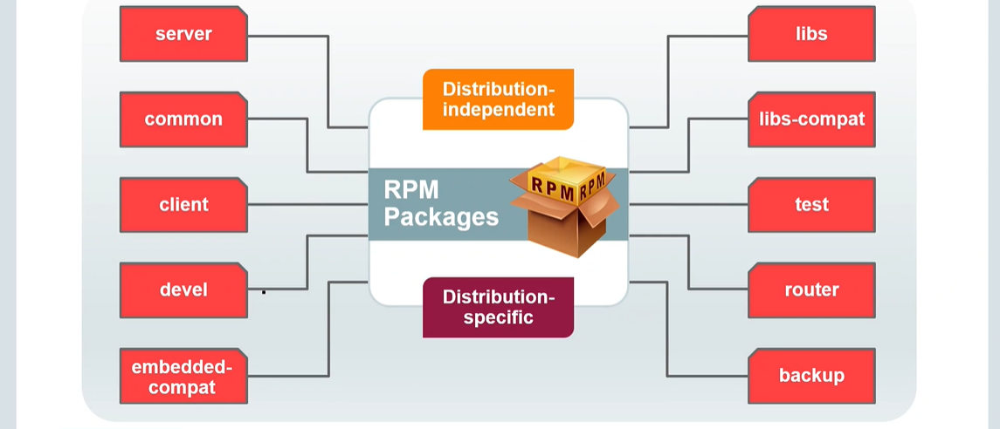

# MySQL 8.0 for Database AdministratorsCourse

---

# Installation and Upgrading

### MySQL Installation - Key Steps

* **Platform Check:** Verify MySQL support for your operating system.
* **Distribution Selection:** Choose a suitable package (pre-compiled binaries like RPM, PKG, MSI, or generic archives like ZIP, TAR.gz; or source code).
* **Download:** Obtain the selected distribution.
* **Installation:** Install the downloaded package.
* **Post-Install Configuration:** Perform any necessary setup after installation.

### Installing MySQL from Downloaded Packages

* After you download MySQL Linux packages, install them by using the following commands:
    * On RPM systems:
        ```bash
        rpm -ivh packagename.rpm
        ```
    * On APT systems:
        ```bash
        dpkg -i packagename.deb
        ```
* You must identify and resolve dependencies when you install packages.
    * Install any dependencies before you install MySQL packages.
        * For example, MySQL has a dependency on the `libaio` library. Data directory initialization and subsequent server startup steps will fail if this library is not installed.
    * Install MySQL packages in the correct order.
        * For example, install the `libs` package before installing `client` or `server`.

### MySQL RPM Installation Files for Linux



### MySQL RPM Installation Files for Linux - Package Descriptions

* **server:** Core MySQL Server daemon (`mysqld`) and server utilities.
* **common:** Shared files and configuration templates for various MySQL components.
* **client:** MySQL client programs (e.g., `mysql` command-line client).
* **devel:** Header files and libraries for developing MySQL client applications.
* **embedded-compat:** Compatibility libraries for embedded MySQL server versions.
* **libs:** Core client libraries used by applications to connect to the server.
* **libs-compat:** Compatibility libraries for older MySQL client library versions.
* **test:** Test suites and files for MySQL installation testing.
* **router:** MySQL Router for transparent routing between applications and servers.
* **backup:** Utilities and scripts for performing MySQL database backups.

**Important Notes:**

* Some packages are **Distribution-Independent**, while others are **Distribution-Specific**.
* Pay attention to **dependencies**. For example, install `libs` before `client` or `server`.
* For a basic setup, you'll typically need `server`, `client`, and `libs`. Install other packages based on your specific requirements.
* Always consult the official MySQL documentation for your specific version and Linux distribution for the most accurate information.

